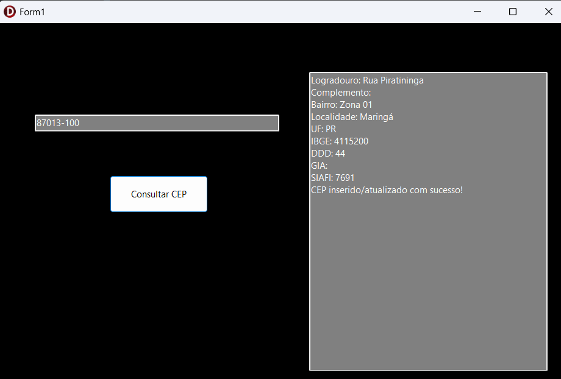

# devdesktopjunior
# Consulta de CEP 
### Desafio Técnico - Banco de Talentos de DEV - TecnoSpeed

## Olá! 👋

Este repositório apresenta a solução que desenvolvi para o desafio técnico proposto, que consistiu na criação de um controle de CEP utilizando API pública do [ViaCEP](https://viacep.com.br/).
 O objetivo principal foi demonstrar minhas habilidades em lógica de programação e integração com APIs, persistência de dados em um banco de dados relacional (PostgreSQL) e utilização de ferramentas de versionamento (Git/GitHub).

## Demonstração em Ação! ✨

A aplicação desenvolvida permite ao usuário inserir um CEP, consultar as informações de endereço correspondentes através da API ViaCEP e visualizar os dados na tela. Além disso, os dados consultados são automaticamente armazenados em um banco de dados PostgreSQL para consultas futuras.

 
**Aplicação Delphi em Execução:**
 

 
*Aqui, uma captura de tela da interface da aplicação Delphi mostrando um CEP consultado e as informações exibidas.*

## Principais Funcionalidades Implementadas 🚀

* **Consulta de CEP:** Implementação de um método para interagir com a API ViaCEP através de requisições HTTP GET, utilizando o CEP fornecido pelo usuário.
* **Modelagem de Dados:** Criação da classe `TCep` para armazenar os dados de endereço retornados pela API.
* **Persistência em PostgreSQL:** Utilização do banco de dados PostgreSQL para armazenar os dados de CEP consultados, com lógica para inserir novos registros ou atualizar existentes.
* **Teste da API:** Utilização do Postman para testar e validar a integração com a API ViaCEP, incluindo consultas por CEP específico e por logradouro.
* **Consulta por UF:** consulta SQL buscar todos os CEPs cadastrados no estado do Paraná (PR) no banco de dados.

## Arquitetura da Solução ⚙️

O projeto é composto pelos seguintes elementos principais:

1.  **Aplicação Desktop (Delphi):**
    * Interface gráfica simples para entrada do CEP e exibição dos resultados.
    * Lógica para consumir a API ViaCEP e manipular os dados JSON.
    * Mecanismo para interagir com o banco de dados PostgreSQL através do FireDAC.
2.  **Banco de Dados (PostgreSQL):**
    * Tabela `TspdCep` para armazenar os dados de endereço (CEP, logradouro, complemento, bairro, localidade, UF, IBGE, DDD).
3.  **Testes de API (Postman):**
    * Collection configurada com requisições de exemplo para a API ViaCEP.

## Conclusão e Agradecimento 🙏

Este desafio foi uma excelente oportunidade para aplicar meus conhecimentos e aprender novas habilidades. Agradeço a oportunidade de apresentar meu trabalho e espero que ele demonstre meu potencial como futura Desenvolvedora.
